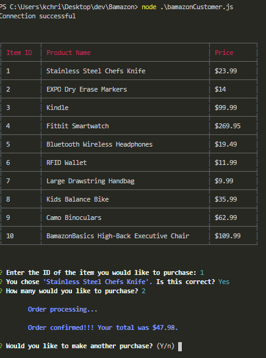
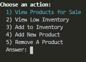
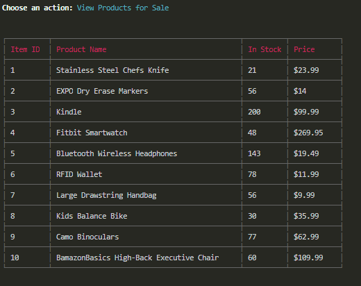
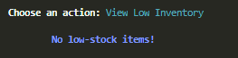
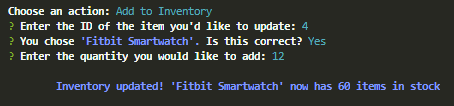
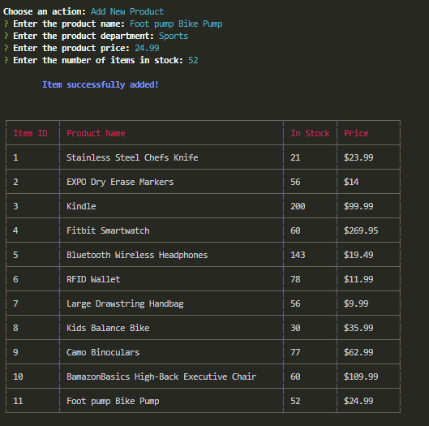
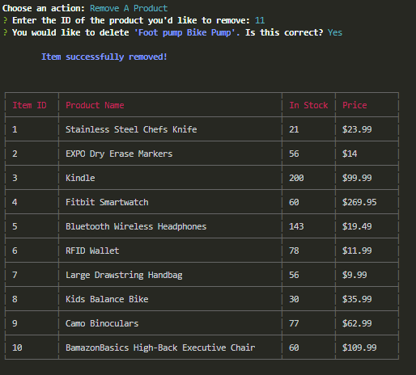

# Bamazon <a id="top"></a>

___

## Overview
Simple command line storefront with two functionalities:

* [**Customer**](#customer-demo)
	* allows user to view and purchase products
* [**Manager**](#manager-demo)
	* allows user to view, update, add, and remove products

___


#### Run Application
Once you have the Bamazon database set up, run these commands in the command line:

```
git clone https://github.com/KChristlieb/Bamazon.git
cd Bamazon
npm install
node bamazonCustomer.js
```
Note: type `node bamazonManager.js` to access the manager portal

___

## Customer Demo <a id="customer-demo"></a>
The customer interface:

```
1) Presents the customer with a table of all available products
2) Asks for the ID of the customer's desired product
3) Asks how many items the customer would like to purchase
4) Confirms order & updates product inventory in database
```


[Scroll to top](#top)

___

## Manager Demo <a id="manager-demo"></a>
The manager interface presents a list of actions:



___

```
1) View Products for Sale
Displays a table of all active products available to the customer
```


___


```
2) View Low Inventory
Displays a table of all products with fewer than 5 items in stock
(or a message that there are no low-stock items)
```


___

```
3) Add to Inventory
Allows the manager to add more items to a product's inventory
```


___

```
4) Add New Product
Allows the manager to list a new product that is available for purchase
```


___

```
5) Remove A Product
Allows the manager to remove a product from the store
```


[Scroll to top](#top)

___

## Technologies Used
* JavaScript
*  [Node JS](https://nodejs.org/en/download/)
* [MySQL](https://dev.mysql.com/doc/refman/5.6/en/installing.html)
* NPM Packages:
	- [mysql](https://www.npmjs.com/package/mysql)
	- [inquirer](https://www.npmjs.com/package/inquirer)
	- [chalk](https://www.npmjs.com/package/chalk)
	- [cli-table](https://www.npmjs.com/package/cli-table)

